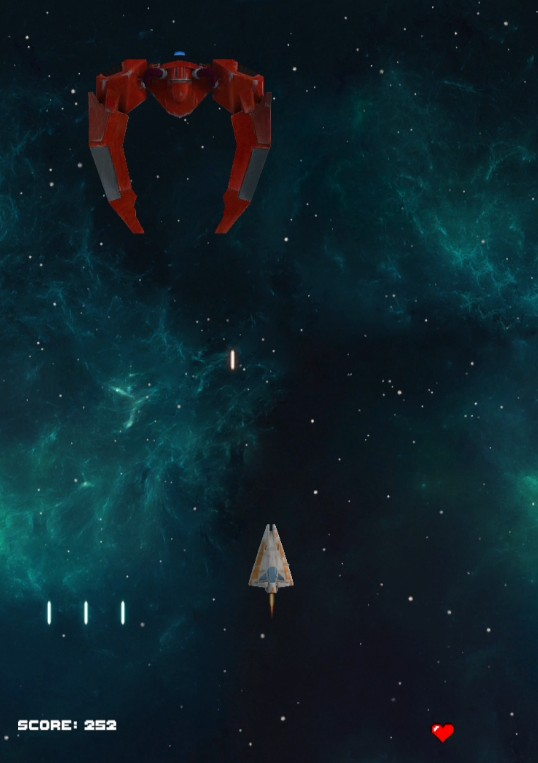

# Space Shooter - Arcade Architecture (Unity/C#)

This project implements a complete **2D Arcade Shooter** engine in Unity, focusing on **OOP principles**, **procedural difficulty scaling**, and **state-driven game loops**.

The codebase demonstrates the practical application of C# scripting to control game logic, relying on standard mathematical functions to drive gameplay mechanics.

<p align="center">
  
</p>

## 🚀 Key Technical Implementation

### 1. Non-Linear Enemy Movement
To improve gameplay variety, the project **applies trigonometric functions** to enemy coordinates. By utilizing `Mathf.Sin`, the system implements a classic "sine wave" movement pattern, making enemy trajectories non-linear and more engaging than standard vertical descents.

### 2. Algorithmic Difficulty Scaling
Implemented within the `GameController`, the game features a progression system that automatically adjusts difficulty. As `waveCounter` increases, the system reduces the `spawnDelay` and enemy shooting intervals, creating a more intense experience without manual level design.

### 3. Boss State Logic
The Boss entity (`BossController.cs`) operates with distinct behavioral phases:
* **Entry Phase:** Smoothly translates into the viewport using a coroutine (`EnterScene`).
* **Combat Phase:** Once in position, it activates the movement constraints and a multi-shot weapon pattern defined in the script logic.

## 🛠 Tech Stack
* **Engine:** Unity (2D Physics Engine)
* **Language:** C#
* **Concepts:** Coroutines (Async Logic), Vectors, Dynamic Instantiation.

## 💻 Code Snippets

### Movement Logic Implementation
*Application of the standard Sine Wave formula in `EnemyShipController.cs` to achieve lateral oscillation:*
```csharp
void Update()
{
    // Moves forward based on speed
    transform.position += Vector3.forward * forwardDirection * speed * Time.deltaTime;

    // Applies Mathf.Sin to calculate lateral offset (Standard Wave Formula)
    float xMovement = Mathf.Sin(Time.time * waveFrequency + waveOffset) * waveAmplitude;
    transform.position += new Vector3(xMovement, 0, 0) * Time.deltaTime;
}
```

### Dynamic Difficulty Adjustment
*Logic in `GameController.cs` that scales difficulty based on progression:*
```csharp
void IncreaseDifficulty()
{
    // Increases enemy count based on wave number
    hazardCount += Mathf.RoundToInt(1f * waveCounter);
    
    // Decreases spawn delay linearly based on the wave progression (capping at 0.4s)
    spawnDelay = Mathf.Max(0.4f, spawnDelay - (0.1f * waveCounter));

    // Increases difficulty by reducing the enemy shooting interval based on the wave progression (capping at 0.8s)
    enemyShootingInterval = Mathf.Max(0.8f, enemyShootingInterval - (0.2f * waveCounter));
}
```

## ⚙️ How to Run
1. Clone this repository.
2. Open **Unity Hub** and click "Add".
3. Select the project folder.
4. Open the scene `Assets/Scenes/Main.unity`.
5. Press the **Play** button.

## 📝 Context
Academic project developed within the scope of the Multimedia Systems course. The goal was to create an interactive application by implementing Object-Oriented scripting (C#), handling real-time user input, and managing the integration of audio-visual assets within a game engine environment.